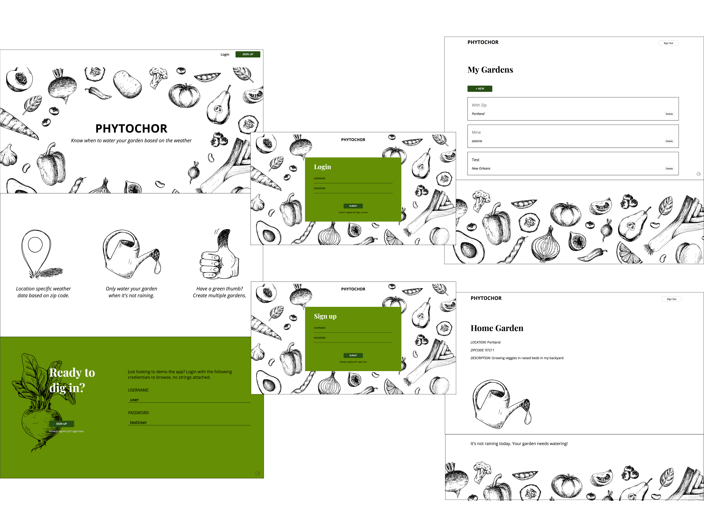
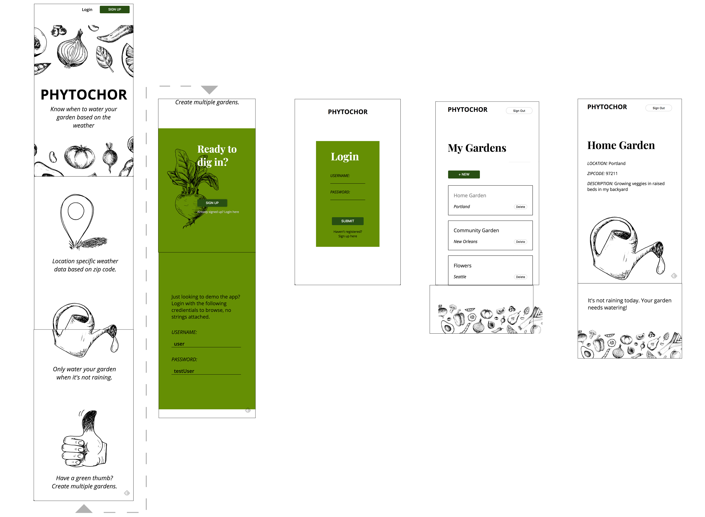

# Phytochor

Know when to water your garden based on the weather. Weather data is based off the zip code provided by the user and fetched from Open Weather Map's API. Users can create multiple gardens at their will.

https://garden-client.herokuapp.com/

## Desktop View

## Mobile View

## Tech stack:
#### Front End
    * React
    * Redux
    * Redux Form
    * CSS Modules
    * HTML5
    * Enzyme

#### Back End
    * MongoDB
    * Node
    * Express
    * JSON Web Token
    * Passport
    * Mocha/Chai

##### Codebase Structure

    client/
        node_modules
        package.json
        README.md
        public/
            index.html
            favicon.favicon
            manifest.json
        src
            actions/ (using redux)
            reducers/ (using redux)
            components/
                styles/ (css)
            images/
                readmeImgs
            __tests__/
            App.js
            index.js
            store.js
            validators.js
            local-storage.js
            setupTests.js

Link to server repo: https://github.com/cadams8238/Garden-app_server
