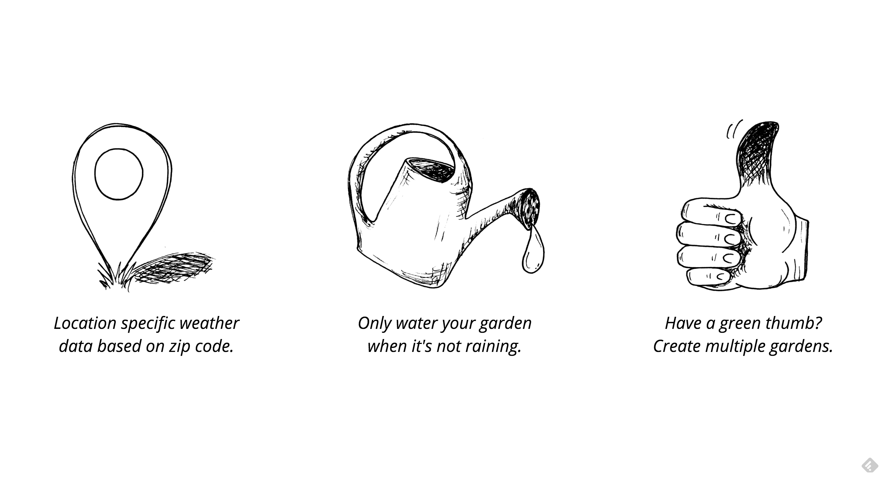
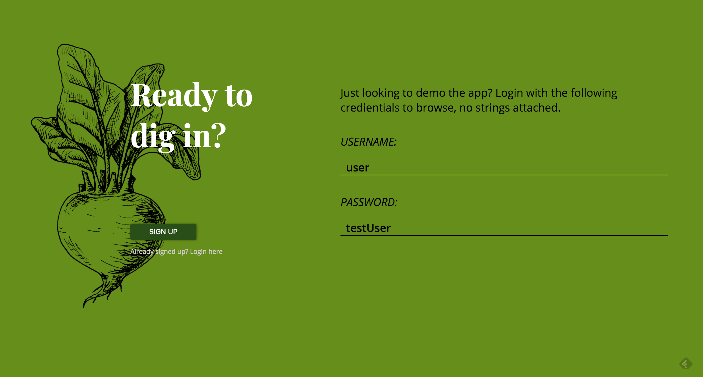
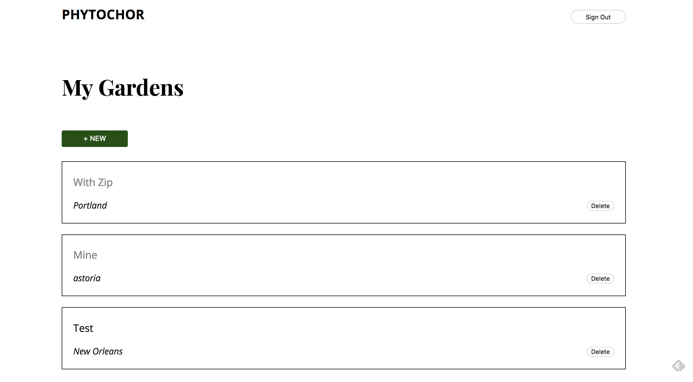
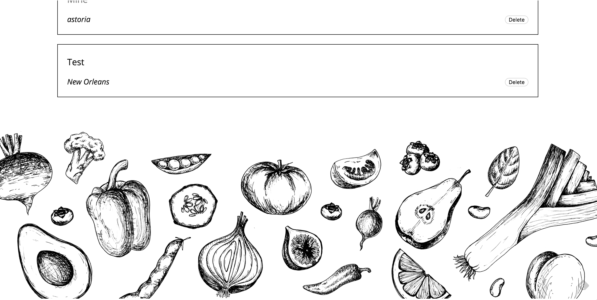
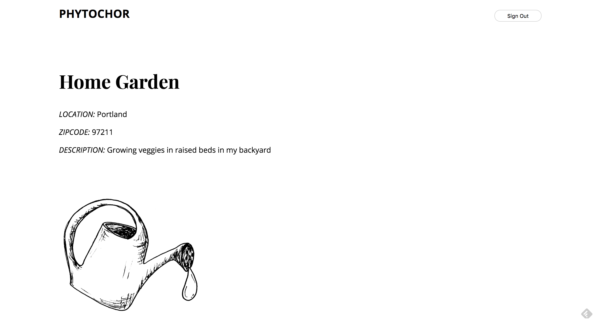
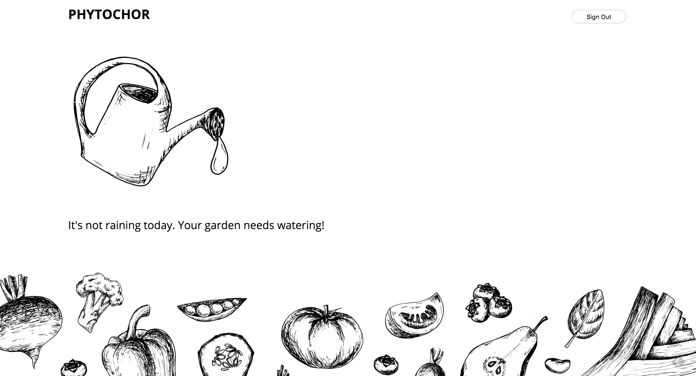

# Phytochor

Know when to water your garden based on the weather. Weather data is based off the zip code provided by the user and fetched from Open Weather Map's API. Users can create multiple gardens at their will.

https://garden-client.herokuapp.com/

## Desktop View

## Mobile View

## Tech stack:
#### Front End
    * React
    * Redux
    * Redux Form
    * CSS Modules
    * HTML5
    * Enzyme

#### Back End
    * MongoDB
    * Node
    * Express
    * JSON Web Token
    * Passport
    * Mocha/Chai

##### Codebase Walkthrough

    * **src:**
        * actions/reducers (using redux)
        * components
            * styles (css)
        * images

Link to server repo: https://github.com/cadams8238/Garden-app_server
